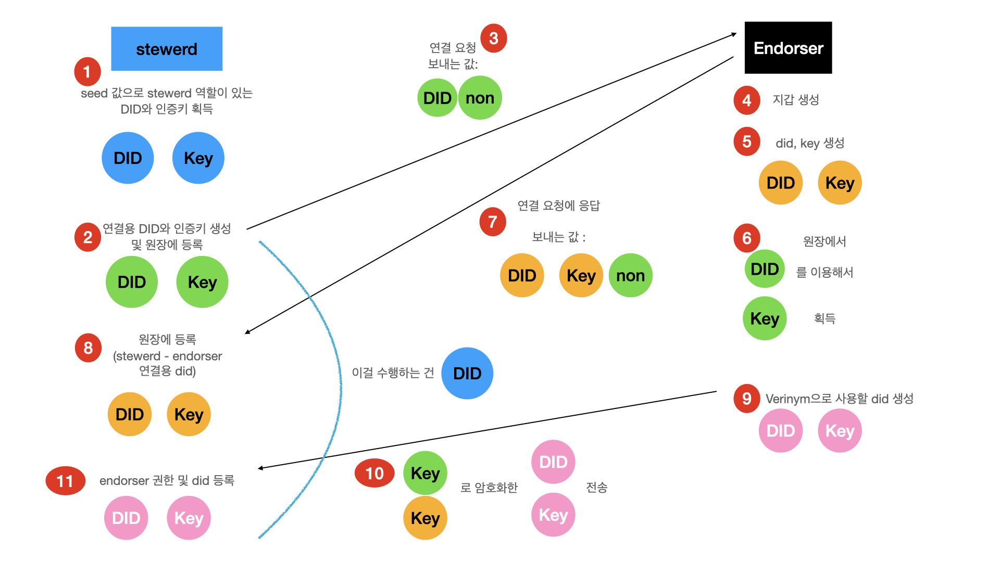
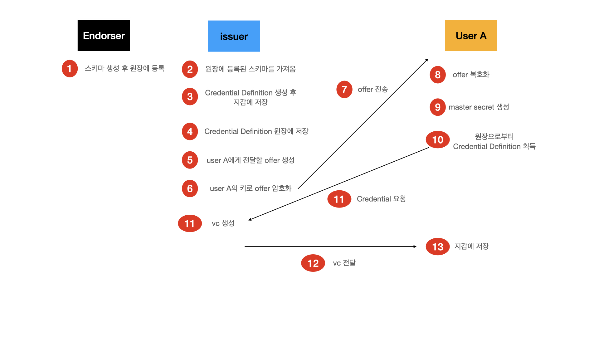

# Hyperledger-Indysdk-Aries-Demo
> Create demo web with Hyperledger Indy-sdk and Aries

Hyperledger Indy [indy-sdk](https://github.com/hyperledger/indy-sdk) 와 [aries-framework-javascript](https://github.com/hyperledger/aries-framework-javascript) 를 공부하면서 자료가 거의 없어서 직접 정리하면서 데모를 만들어 보기로 했습니다.

## Develop Environment
- node.js v12
- npm v6
- webstorm

## Installation
1. Install [Libindy]
   - [Libindy 설치 방법 및 트러블슈팅](https://til.miryang.dev/docs/HyperledgerIndy/aries-framework-javascript-install/)
2. Clone and Create branch
    ```bash
    git clone https://github.com/MiryangJung/Hyperledger-Indysdk-Aries-Demo
    git checkout -b New_Branch
    ```
3. Install Dependencies And Start
    ```bash
    npm install
    npm start
    ```

---

## 개발해야할 기능


## 트러블 슈팅

## 학습한 내용
### [indy-walkthrough#alice-gets-a-transcript](https://github.com/hyperledger/indy-sdk/blob/master/docs/getting-started/indy-walkthrough.md#alice-gets-a-transcript) 까지 공부하고, 정리한 내용
  
  

